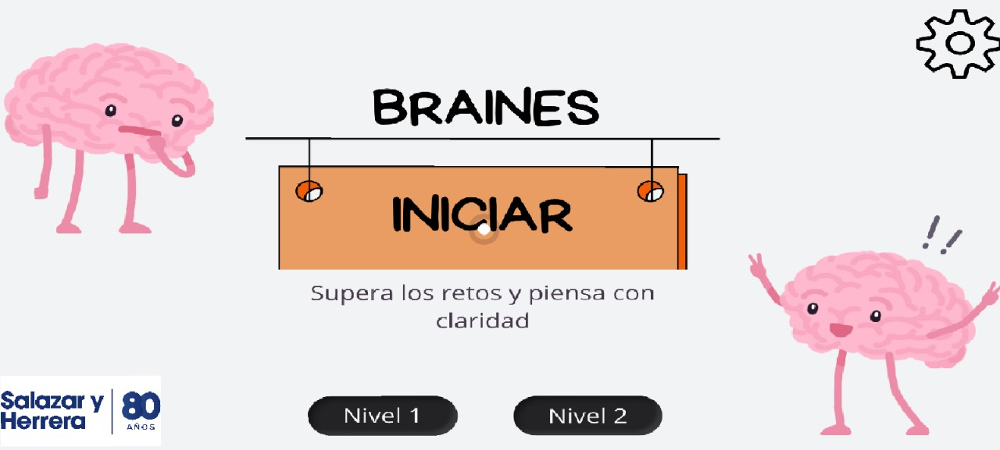
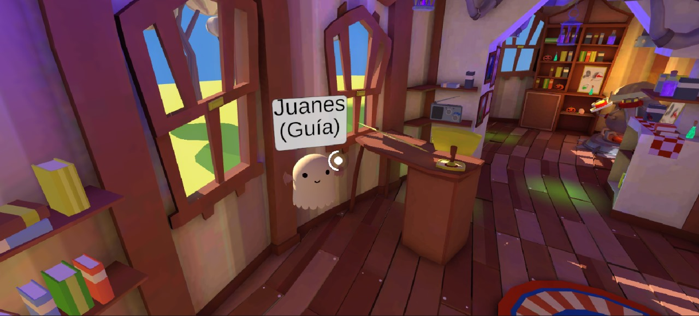
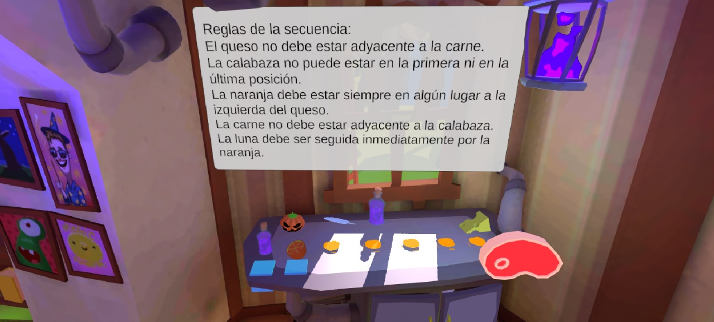
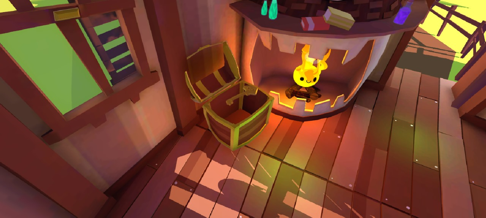
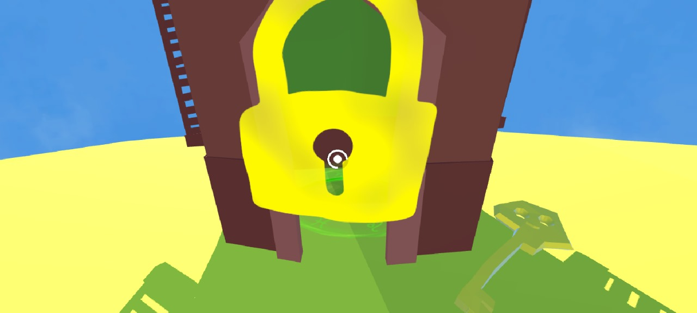
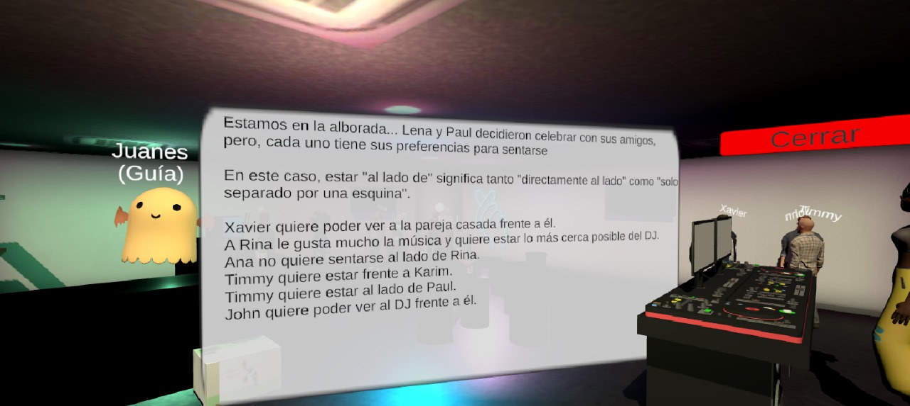
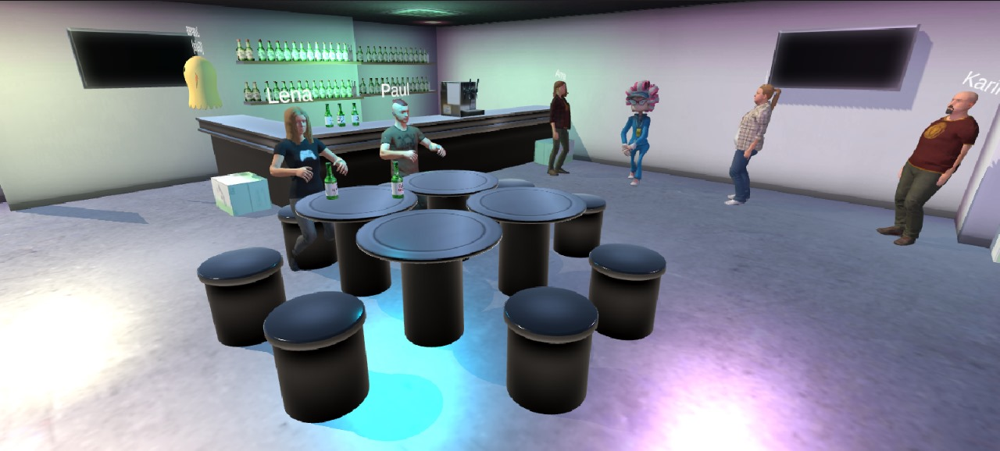
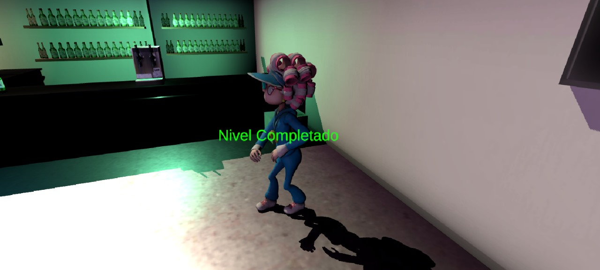
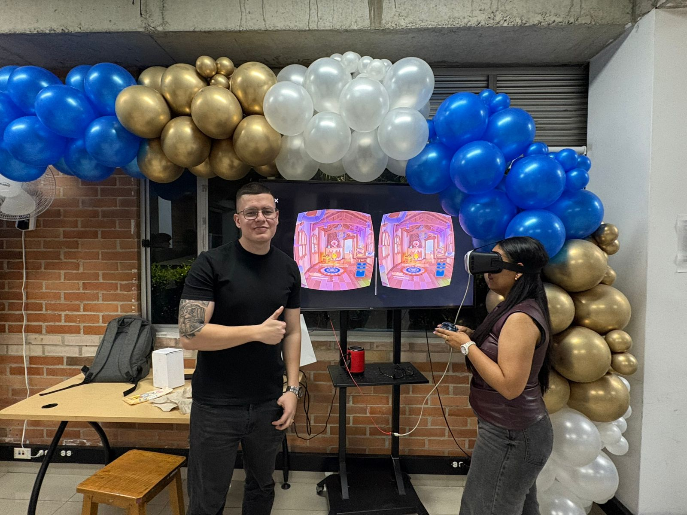
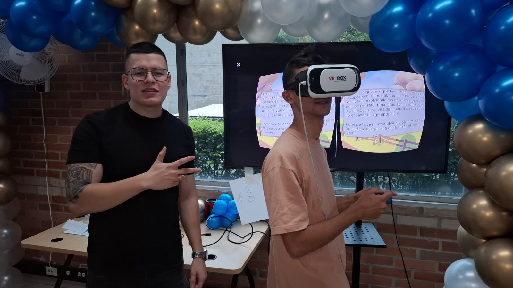

🌟 **Introducción**

El nombre Braines surge de la combinación de las palabras en inglés Brain (cerebro) y Escape (escape), reflejando la esencia del proyecto: un escape room mental.

Este proyecto nació de la necesidad de las instituciones académicas (Institución Universitaria Salazar y Herrera y la Universidad Nacional de Colombia) de implementar metodologías de enseñanza más didácticas e inmersivas (gamificación).

Braines ambienta ejercicios de pensamiento computacional (con planes de expandirse a otras áreas del conocimiento) dentro del formato de las escape rooms, donde los estudiantes deben resolver acertijos y retos para avanzar de nivel. Este prototipo inicial incluye el menú principal y dos niveles de desafío.

🛠️ **Tecnología**

El proyecto fue desarrollado utilizando Unity y se integró el plugin de Google Cardboard para ofrecer una experiencia de Realidad Virtual (RV) inmersiva. Se optó por el desarrollo para dispositivos móviles para garantizar una implementación económica y accesible en cualquier institución educativa, evitando la necesidad de hardware costoso como Meta Quest u Oculus.

👁️ **Interacción (Gaze Selector)**

Para la interacción con objetos, personajes y elementos de la interfaz (UI), se implementó un gaze selector (selector de mirada) que luego de cierto tiempo ejecuta la acción deseada. El usuario simplemente debe enfocar su mirada en el elemento deseado durante un tiempo determinado para ejecutar la acción correspondiente (seleccionar, activar, etc.).

**Menú:**

**🚪 Nivel 1: El Acertijo de la Secuencia**

En el Nivel 1, los estudiantes se encuentran dentro de una casa y deben resolver un acertijo lógico para desbloquear un cofre digital. El objetivo final es obtener la llave dentro del cofre para abrir el portal de salida.

**🎯 Tarea Principal**

Al final de la habitación hay una mesa con unos objetos, debes ubicarlos como lo indica la secuencia, al hacerlo se abrirá el cofre que está aquí a tu derecha, deberás coger la llave, salir de la casa y abrir la puerta de la caseta ubicada a tu izquierda.

**🕹️ Controles del Nivel**

Coger Objetos: Para coger los objetos solo debes mirarlos y esperar a que se llene la barra de carga.

Soltar Objetos (Secuencia): Para soltarlos debes mirar hacia las bases naranjas ubicadas en la mesa teniendo el objeto en la mano.

Reiniciar/Reubicar: Si te equivocas en la secuencia, cuentas con unas bases azules para poder soltar los objetos y reubicar toda la secuencia.

**📝 Reglas de la Secuencia (Restricciones)**

El queso no debe estar adyacente a la carne.

La calabaza no puede estar en la primera ni en la última posición.

La naranja debe estar siempre en algún lugar a la izquierda del queso.

La carne no debe estar adyacente a la calabaza.

La pluma debe ser seguida inmediatamente por la naranja.

**🥳 Nivel 2: La Organización Social**

El Nivel 2 presenta un desafío de organización y lógica de restricciones, ambientado en una reunión de amigos (alborada), donde el jugador debe ordenar a los invitados en una mesa circular para que todos estén cómodos según sus preferencias.

**🎯 Tarea Principal**

Estamos en la alborada... Lena y Paul decidieron celebrar con sus amigos, pero, cada uno tiene sus preferencias para sentarse

En este caso, estar "al lado de" significa tanto "directamente al lado" como "solo separado por una esquina".

**📝 Preferencias (Restricciones)**

Xavier quiere poder ver a la pareja casada frente a él.

A Rina le gusta mucho la música y quiere estar lo más cerca posible del DJ.

Ana no quiere sentarse al lado de Rina.

Timmy quiere estar frente a Karim.

Timmy quiere estar al lado de Paul.

John quiere poder ver al DJ frente a él.

**Evidencias:**

